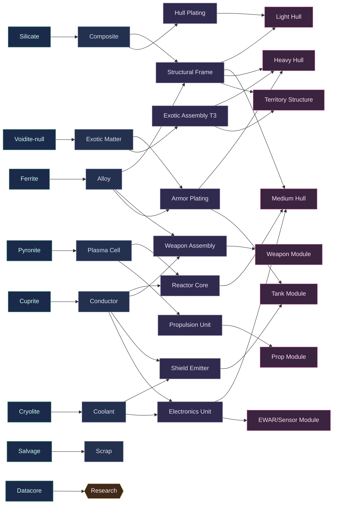

# EarthRise — Resource & Crafting Dependency Graph

> Companion to `masterplan.md` §13.4 (player-driven crafting economy), §13.5 (tiered
> security), §15 (persistence: economy events are write-through/outbox). **Status:**
> DRAFT v0.1. **Principle:** destruction creates demand — almost everything players
> fly is **player-built**, so loot-on-kill and conquest feed a real economy.

---

## 1. The four production stages

```
  RAW  ──refine──▶  REFINED  ──fabricate──▶  COMPONENTS  ──assemble──▶  PRODUCTS
 (mine/salvage)     (materials)              (sub-assemblies)          (ships/modules/
                                                                        structures)
```

- **Stage owners:** Harvester mines RAW; refining (Industry tech) → REFINED; Builder
  + base shipyard fabricate COMPONENTS and assemble PRODUCTS.
- **Every transaction** (trade, build-completion, market order, loot) is an **economy
  event** → write-through/outbox, **zero-loss** (masterplan §15).

---

## 2. Raw resources (mined / salvaged / scanned)

| Raw | Source | Tier scarcity | Feeds |
| --- | --- | --- | --- |
| **Ferrite** | common asteroid nodes | everywhere | Alloy |
| **Silicate** | common asteroid nodes | everywhere | Composite |
| **Cuprite** | metal nodes | high+ (richer low/null) | Conductor |
| **Pyronite** | energy nodes | low/null | Plasma Cell |
| **Cryolite** | ice nodes | low/null | Coolant |
| **Voidite** | rare null-sec nodes / deep anomalies | **null only** | Exotic Matter (T3) |
| **Salvage** | wrecks (post-combat) | wherever fights happen | Scrap → components |
| **Datacore** | anomalies/expeditions, NPC salvage | scales with site difficulty | **Research** (`tech-tree.md`) |

> **Scarcity = the risk→reward engine:** the best inputs (Pyronite, Cryolite,
> Voidite) live in low/null, so the crafting economy *pulls* players into PvP space
> (§13.5). High-sec can make T1 freely but not T3.

---

## 3. Refined materials

| Refined | From (raw) | Used in |
| --- | --- | --- |
| **Alloy** | Ferrite | Structural Frame, Armor Plating |
| **Composite** | Silicate | Hull Plating, cargo/structure |
| **Conductor** | Cuprite | Electronics, Weapon Assembly |
| **Plasma Cell** | Pyronite | Reactor Core, energy weapons |
| **Coolant** | Cryolite | Shield Emitter, reps |
| **Exotic Matter** | Voidite | **T3** components only |
| **Scrap** | Salvage | cheap filler into components |

Refining yield improves with Industry tech (`tech-tree.md` §3.4).

---

## 4. Components (sub-assemblies)

| Component | Built from | Goes into |
| --- | --- | --- |
| **Structural Frame** | Alloy + Composite | all hulls |
| **Hull Plating** | Composite (+Scrap) | hulls, armor modules |
| **Reactor Core** | Plasma Cell + Conductor | all hulls (power), big modules |
| **Weapon Assembly** | Conductor + Alloy (+Plasma for energy) | weapon modules |
| **Shield Emitter** | Coolant + Conductor | shield modules, base shield |
| **Armor Plating** | Alloy (+Exotic for T3) | armor modules, heavy hulls |
| **Electronics Unit** | Conductor + Coolant | EWAR, sensors, fitting CPU |
| **Propulsion Unit** | Plasma Cell + Alloy | engines, prop modules |
| **Exotic Assembly** | Exotic Matter + any T2 component | **T3 hulls/modules only** |

---

## 5. Products (what players field)

| Product | Built from (components) | Tech gate |
| --- | --- | --- |
| **Light hull** | Frame + Plating + small Reactor | Mobility T1 |
| **Medium hull** | Frame×2 + Plating + Reactor + Electronics | Mobility T1 |
| **Heavy hull** | Frame×3 + Armor Plating + Reactor×2 + Exotic Assembly | Mobility T2 |
| **Industrial hull** | Frame + Plating×2 + Reactor | Industry T1 |
| **Weapon module** | Weapon Assembly + Conductor | Weaponry T1–T3 |
| **Tank module** | Shield Emitter / Armor Plating + Coolant | Defense T1–T3 |
| **EWAR/sensor module** | Electronics Unit + Conductor | Electronics T1–T3 |
| **Prop module** | Propulsion Unit | Mobility T1–T2 |
| **Territory structure** | Frame×N + Reactor×N + Exotic Assembly | Industry T3 |
| **Base repairs/upgrades** | Plating + Reactor + Shield Emitter | various |

---

## 6. Full dependency graph (Mermaid)



---

## 7. Markets, currency & sinks

- **Regional markets** (not one global AH): buy/sell orders at trade hubs; **price
  differs by region** → hauling/trade gameplay and piracy targets in low/null
  (masterplan §13.4).
- **Single currency.** Faucets: NPC bounties (invasions/anomalies), selling to the
  minimal NPC seed orders. **Sinks** (keep loot-economy from inflating):

| Sink | Drains |
| --- | --- |
| Ship insurance payouts vs premiums (§13.9) | net currency on PvP churn |
| Market transaction fees | every trade |
| Refit / repackaging costs | fitting churn |
| Territory structure **upkeep/tax** (§13.6) | conquest holders |
| Base repair / fuel / jump cost | mobility & defense |

- **Destruction → demand:** every ship lost in PvP/PvE must be **rebuilt** from this
  chain → steady demand for raw/refined/components → reason to mine, refine, haul,
  and fight over resource-rich low/null. This is the economic flywheel.

---

## 8. Worked example — replacing a lost Medium Fighter

```
Lose 1 Medium Fighter (PvP)  ──▶  insurance pays partial currency (sink/faucet)
Rebuild needs:
  Medium Hull = 2×Frame + Hull Plating + Reactor + Electronics
              = (Alloy+Composite)×2 + Composite + (Plasma+Conductor) + (Conductor+Coolant)
  + 3× Weapon Module = 3×(Weapon Assembly + Conductor)
  + fit (tank/prop/low) modules
Raw shopping list ≈ Ferrite, Silicate (lots) + Cuprite, Pyronite, Cryolite (some)
  → buy on market (someone mined/refined it) OR mine it yourself.
```
Every arrow above is a market opportunity for another player — the loop that makes a
**player-driven** economy (vs NPC vendors).

---

## 9. Open questions (track)
- Number of raw types: 6 + salvage + datacore is the v0.1 proposal — more = richer
  but harder to balance/UI at 100 players.
- Refining as a separate **structure/role** or a base function? (affects industry
  gameplay depth)
- Market order matching at scale: per-region order books as economy events — how it
  shards if the game grows past one shard (masterplan §19).
- Insurance payout % and premium (the master risk dial — tune with `combat-balance.md` §7).

> See also: `tech-tree.md` (gates which products you can build) and
> `combat-balance.md` (what the built ships/modules do).
